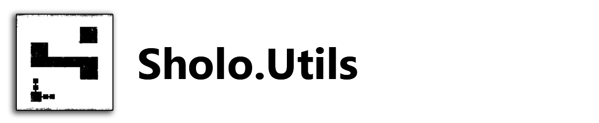

# Sholo.Utils

This repository contains miscellaneous utility functions and extension methods.  The packages here are depended upon by other Sholo packages.

## Thanks

A huge thanks to [@RahenSaeedUK](https://twitter.com/RehanSaeedUK) for the [.NET Boxed Templates](https://github.com/Dotnet-Boxed/Templates), without which I probably
would have never gotten around to releasing any of this.

## Related Projects

I've been building a bunch of small utilities, applications, and container related to home automation,
primarily using MQTT and/or [Home Assistant](https://www.home-assistant.io/).

There are a few foundational libraries/frameworks that I've created along the way.  The table shows the third-party pieces
they're built on.

<table width="100%">
    <tr>
        <th colspan="4">Home Automation Foundation Libraries</th>
    </tr>
    <tr>
        <th width="25%"><a href="https://github.com/scottt732/Sholo.CommandLine">Sholo.CommandLine</a></td>
        <th width="25%"><a href="https://github.com/scottt732/Sholo.HomeAssistant">Sholo.HomeAssistant</a></td>
        <th width="25%"><a href="https://github.com/scottt732/Sholo.Mqtt">Sholo.Mqtt</a></td>
        <th width="25%"><a href="https://github.com/scottt732/Sholo.Utils">Sholo.Utils</a></td>
    </tr>
    <tr>
        <th width="25%"><a href="https://github.com/natemcmaster/CommandLineUtils">natemcmaster/CommandLineUtils</a></td>
        <th width="25%">-</td>
        <th width="25%"><a href="https://github.com/chkr1011/MQTTnet">chkr1011/MQTTnet</a></td>
        <th width="25%">-</td>
    </tr>
</table>

And a handful of applications that I plan to publish soon.

## License

MIT License

Copyright (c) 2020 Scott Holodak

Permission is hereby granted, free of charge, to any person obtaining a copy
of this software and associated documentation files (the "Software"), to deal
in the Software without restriction, including without limitation the rights
to use, copy, modify, merge, publish, distribute, sublicense, and/or sell
copies of the Software, and to permit persons to whom the Software is
furnished to do so, subject to the following conditions:

The above copyright notice and this permission notice shall be included in all
copies or substantial portions of the Software.

THE SOFTWARE IS PROVIDED "AS IS", WITHOUT WARRANTY OF ANY KIND, EXPRESS OR
IMPLIED, INCLUDING BUT NOT LIMITED TO THE WARRANTIES OF MERCHANTABILITY,
FITNESS FOR A PARTICULAR PURPOSE AND NONINFRINGEMENT. IN NO EVENT SHALL THE
AUTHORS OR COPYRIGHT HOLDERS BE LIABLE FOR ANY CLAIM, DAMAGES OR OTHER
LIABILITY, WHETHER IN AN ACTION OF CONTRACT, TORT OR OTHERWISE, ARISING FROM,
OUT OF OR IN CONNECTION WITH THE SOFTWARE OR THE USE OR OTHER DEALINGS IN THE
SOFTWARE.
